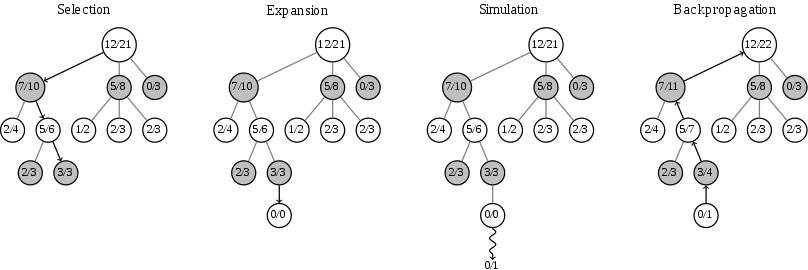
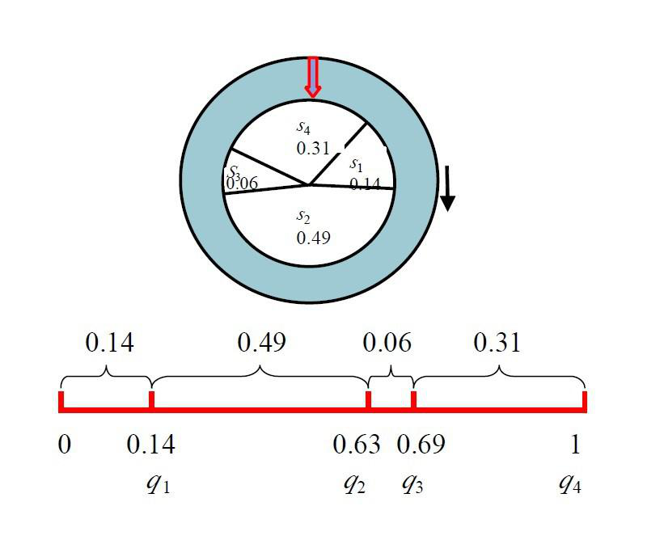
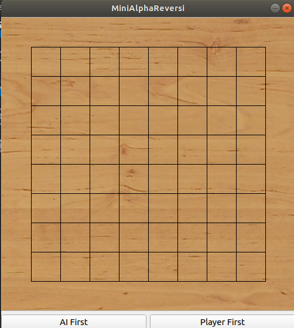
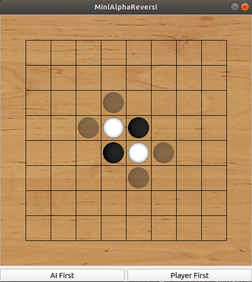
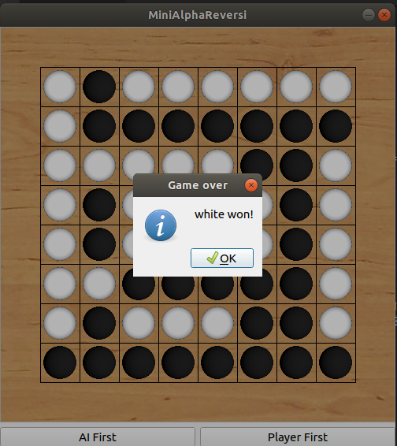

<center>

# MiniAlphaReversi

</center>

序号|学号|专业班级|姓名|性别
-|-|-|-|-
1|3150101155|计科1504|余锦成|男
2|3150103688|计科1505|方浩|男


## 1. Project Introduction
### 1.1. 开发环境
- 操作系统：Ubuntu18.04、MacOS Sierra 10.12.6、Windows 10 1604
- 开源框架：Qt 5.10.0（使用了比较新的语法，Qt版本要求较高）
- IDE：Qt Creator 4.2.1
- 格式化工具：ClangFormat
- 项目管理工具：git

### 1.2. 工作分配简介
- 方浩：debug，测试，添加启发式算法，轮盘赌选择算法
- 余锦成：GUI设计，基本逻辑架构，MCTS实现

## 2. Technical Details
### 2. 理论阐述
#### 2.1.1. 蒙特卡洛树搜索（MCTS）
蒙特卡洛树搜索（Monte Carlo tree search， MCTS）是一种人工智能问题中做出最有决策的方法，一般是在组合博弈中的行动（move）规划形式。它结合了随机模拟的一般性和树搜索的准确性。
蒙特卡洛树搜索的每个循环包括四个步骤：
- 选择（Selection）：从根节点 R 开始，递归选择最优的子节点，直到达到叶子节点L。
- 扩展（Expansion）：如果L不是一个终止节点，那么就创建一个或者更多的字子节点，选择其中一个C。
- 模拟（Simulation）：从C开始运行一个模拟的输出，直到博弈游戏结束。
- 反向传播（Backpropagation）：用模拟的结果输出更新当前行动序列。
#### 2.1.2. UCT节点选择
选择子结点的主要困难是在较高平均胜率的移动后对深层次变型的利用和对少数模拟移动的探索二者中保持某种平衡。第一个在游戏中平衡利用与探索的公式被称为UCT（Upper Confidence Bounds on Tree），由匈牙利国家科学院计算机与自动化研究所高级研究员列文特·科奇什与阿尔伯塔大学全职教授乔鲍·塞派什瓦里提出。UCT基于奥尔（Auer）、西萨-比安奇（Cesa-Bianchi）和费舍尔（Fischer）提出的UCB1公式，并首次由马库斯等人应用于多级决策模型（具体为马尔可夫决策过程）。科奇什和塞派什瓦里建议选择游戏树中的每个结点移动，从而使表达式具有最大值。

在该公式中：
- 代表第次移动后取胜的次数；
- 代表第次移动后仿真的次数；
- 为探索参数—理论上等于，在实际中通常可凭经验选择；
- 代表仿真总次数，等于所有的和。
本项目中，在最后决策时，使用了UCT的变形。

#### 2.1.3. 黑白棋启发策略
- 多子策略
黑白棋规则规定，获胜方是对局结束时己方颜色的棋子较多的那一方。新手往往倾向于把这个长期目标当成短期策略：他们在对局的各个阶段都试图拥有更多的棋子。为此，他们下的每步棋都要翻转尽可能多的棋子，这就叫多子策略。
- 奇偶策略
走子尽量走在一行或一列有奇数个空子的位置。
- 机动性策略
黑白棋每一步的可走子都是有限的，机动性策略是指走子使得对手的可走子较少，从而逼迫对手不得不走出差的一步（bad move），使得自己占据先机。
- 稳定子——位置策略
位于角上的棋子不可能被翻转，因为它永远也不会被对手的两个棋子夹住。因此位于角上的棋子就是最简单的稳定子实例。另外，一旦有棋子占角，相邻的同色棋子通常也变成了稳定子。
- 边界策略
每步棋都必须下在与对手棋子相邻的空位上，这一原理将指导我们选择好的棋步。
每步棋你都必须至少翻转对手一个棋子，因此很显然地，对手与空位相邻的棋子越多，你可下的棋步就越多，而你的行动力也就越好。相反地，如果你的棋子很少与空位相邻，那么你的对手就几乎没有棋步可下。与空位相邻的棋子叫做作边缘子（Frontier disc）；其余的叫做内部子（Internal disc）。边缘子的集合叫做边界（Frontier）。根据我们刚才所说的，很自然地要努力减少你的边缘子数量。
- 斯通纳陷阱
斯通纳陷阱分两个阶段进行：攻击者先通过下星位获得对斜线的控制，然后他攻击对手的弱边（包含一个C位的边），并威胁要占角。而对手无法以夺回边来回应，因为这种情况下，他将翻回前一步所下的星位。
- 位置优先策略
考虑到角点的重要性，把棋盘上的每一个子都赋予一个优先级，每一步从可走子里选择优先级最高的一个子。
- 消失策略
在棋盘比试的前期，己方的子越少往往意味着局势更优。因此在前期可采用使己方的子更少的走子。

黑白棋还有更多更复杂的策略，以上只列举常见的几种。本项目主要采用位置优先策略和机动性策略。

#### 2.1.4. 轮盘赌选择算法
在最后的决策判断中，不是单纯地选择得分最高的节点，而是使用轮盘赌选择算法。轮盘赌选择策略，是最基本的选择策略之一，节点被选中的概率与最后的得分的值成正比。
使用轮盘赌选择主要是解决有些节点的得分比较相近的问题，给次优解被选中的概率。

### 2.2. 算法实现
#### 2.2.1. 蒙特卡洛树搜索
以下是完整的一次搜索

本项目使用多线程模拟与定时中断，多次模拟结束后选择最优解。

#### 2.2.2 启发式改进
使用Priority Table

<table>
<tr><td>1</td><td>9</td><td>2</td><td>4</td><td>4</td><td>2</td><td>9</td><td>1</td><tr>
<tr><td>9</td><td>10</td><td>8</td><td>7</td><td>7</td><td>8</td><td>10</td><td>9</td><tr>
<tr><td>2</td><td>8</td><td>3</td><td>5</td><td>5</td><td>3</td><td>8</td><td>2</td><tr>
<tr><td>4</td><td>7</td><td>5</td><td>6</td><td>6</td><td>5</td><td>7</td><td>4</td><tr>
<tr><td>4</td><td>7</td><td>5</td><td>6</td><td>6</td><td>5</td><td>7</td><td>4</td><tr>
<tr><td>2</td><td>8</td><td>3</td><td>5</td><td>5</td><td>3</td><td>8</td><td>2</td><tr>
<tr><td>9</td><td>10</td><td>8</td><td>7</td><td>7</td><td>8</td><td>10</td><td>9</td><tr>
<tr><td>1</td><td>9</td><td>2</td><td>4</td><td>4</td><td>2</td><td>9</td><td>1</td><tr>
<table>

在Final Decision中加入基于优先级的评分指数
```c++
int level = this->priorityOf(child->move_.x(), child->move_.y());
if (level >= 5) {
  level -= 10;
}
if (!skip) {
  value = value + alpha * 1.0 / (level + 0.01);
}
```
另外也加入了基于行动力的启发，原则是倾向于选择使得对方行动力最低的节点
```c++
double actionRate =
    1.0 /
    (child->rule_.getRivalMovement(child->state_, child->move_).length() +
     0.01);

if (!skip) {
  value = value * beta * actionRate;
}
```

#### 2.2.3. 轮盘赌选择算法
首先把节点的得分归一化，然后计算累计概率密度，生成一个0~1的随机数，数字落在那个区间，就选择对应的节点。


### 2.3. 技术细节
为了便于说明，以下引用的代码可能跟实际代码有所不一样。
#### 2.3.1. 蒙特卡洛树结构
在蒙特卡洛树的实现中，我们使用了Qt自带的对象树结构。所以我们的蒙特卡洛树节点继承`QObject`。在创建子节点的时候，把自己传递给自己儿子：
```c++
void MCN::newChild() {
  new MCN(..., this);
}
```
这样的好处是，可以直接使用`children()`获取所有的儿子，可以直接调用`parent()`获取父亲。并且父亲在析构之前，会自动析构儿子，无须操心内存管理。为了方便查找儿子和付清，我重载了这两个函数：
```c++
QList<MCN *> children() const;
MCN *parent() const;
```

此外，还需要实现一些蒙特卡洛树搜索需要用到的函数（参考Slide中的函数）。具体实现的接口有如下：
```c++
void MTC::search()
```
对当前的蒙特卡洛树进行搜索。
```c++
MCN *MTC::treePolicy() const;
```
树策略，用于返回一个未被搜索过的节点。
```c++
int MTC::defaultPolicy(MCN *node) const;
```
默认策略。用于对某个节点进行模拟搜索，并且返回reward。
以上两个策略都需要使用随机数生成。这里我们使用了Qt 5.10后提供的`QRandomGenerator`，该类可以通过调用系统接口生成真随机数。
```c++
void MTC::backUp(MCN *node, unsigned const &delta) const;
```
回溯更新节点。在获取reward后，更新节点以及其父节点的总Reward。
```c++
MCN *MCN::bestChild(const double &c) const;
```
返回在给定c之后，该节点value最大的儿子。
其中value函数为：
```c++
double MCN::value(const double &c) const;
```
这个函数使用的公式为：
$$
v=\frac{w_i}{n_i}+c\sqrt{\frac{2\ln t}{n_i}}
$$
其中$w_i$为代表第i次移动后取胜的次数；$n_i$代表第i次移动后仿真的次数；$c$为探索参数—理论上等于$1$，在实际中通常可凭经验选择；$t$代表仿真总次数，等于所有$n_i$的和。

#### 2.3.2. 规则实现
本次项目中一个很重要的点是实现一个黑白棋的规则。只有在正确的规则下，我们设计的AI才能正确地搜索下去，才能正确评估自己的优略。因此我们设计了一个规则类，作为游戏裁判角色。其主要的接口有如下：
```c++
bool valid(size_t const &x, size_t const &y, Config::Type const &player,
             State const &state) const;
```
这个函数用于判断在state状态下，player能否在(x, y)下子。用于判断用户下子地方的正确性。

```c++
Movement availableMovement(Config::Type const &player,
                             State const &state) const;
```
这个函数用来获取state状态下，player能下子的所有位置。
```c++
const Movement apply(size_t const &x, size_t const &y,
                       Config::Type const &player,
                       State const &state) const;
```
这个函数返回在当前状态state下，player在(x, y)下子后会产生的棋局变化。即哪些位置应该变成什么颜色的组合。
```c++
bool judge(State const &state, Config::Type const &player) const;
```
该函数返回在状态state下，player方棋子数是否占有优势。
```c++
Movement getRivalMovement(size_t const &x, size_t const &y,
                            Config::Type const &player,
                            State const &state) const;
```
这个函数返回在状态state下，player下在(x, y)下子后，另一方接着可以下在哪些位置。

这些接口和函数能够满足界面渲染以及蒙特卡洛树搜索的需要。

#### 2.3.3. 分离渲染线程和搜索线程
在实现中，如果采用单线程进行工作，会使得落子之后，使用渲染线程进行蒙特卡洛搜索的话，会造成画面卡住。那么我们可以单独给蒙特卡洛树搜索设置一个新的线程。这样界面就不会卡住了。
经过我们讨论，我们不打算给蒙特卡洛树搜索多开几个线程。因为我们的搜索空间比较小，一个`DefaultPolicy`很快就模拟完成，创建线程比搜索消耗来得更大。此外，`TreePolicy`进行多线程搜索的话，线程之间同步造成的消耗也更大，因为我们放弃使用多线程搜索。

因为我们使用了Qt库，其使用多线程还是比较方便的。只需要在`MCT`中使用
```c++
this->moveToThread(new QThread);
```
即可使蒙特卡洛树中的槽(slot)在被信号(signal)激活后，在另外一个线程中执行。


## 3.Experiment Results
用图文并茂的形式给出实验结果，如系统界面、操作说明、运行结果等，并对实验结果进行总结和说明。
### 3.1. 系统界面
系统仅有一个界面，打开之后的界面就是：

中间是棋盘，用于显示棋局。下方两个按钮决定下子顺序。
### 3.2. 操作说明
点击`AI First`可以让AI执黑重新开始游戏，并且让AI先落子。如果选择`Player First`则可以让Player执黑重新开始游戏，让Player先落子。
为了说明问题，这里我们选择玩家先落子，界面如下所示：

在界面上，非透明的子为实际已经下好的子。而半透明的子（图上显示为黑子）为当前玩家可以下的位置。在玩家落子时候，玩家可以只下在有半透明棋子的位置。在AI落子时候，AI会下在有半透明棋子的位置，但是玩家并不可以通过点击棋盘下子。
在跳过落子时候，会直接跳过落子。
### 3.3. 运行结果
在游戏结束后，会跳出界面显示胜负结果：

可以看到，我们被自己的AI打败了。
### 3.4. 总结
这次项目非常有趣，虽然黑白棋是一个规则非常简单，搜索量也非常小的棋类游戏，但是对于我们用来实现蒙特卡洛树非常合适。虽然我们最后没有取得胜利，但是这个项目让我们更好地了解了蒙特卡洛树搜索的实现思路原理和方法，对我们以后科研非常有帮助。

## References
[1]: *Artificial Intelligence A Modern Approach*, Stuart Russel, Peter Norvig
[2]: *Analysis of Monte Carlo Techniques in Othello*, Ryan Archer
[3]: *Deep learning with Othello*, Sun Peigen, Xu Chaoyi
[4]: *Experiments with Monte Carlo Othello*, Philip Hingston, Martin Masek
[5]: *Playing Othello Using Monte Carlo*, J.A.M. Nijssen